# Financial Report
## Budget Analysis
We extracted transaction data for the last 90 days. The information recived was for 48 transaction between 01/25/2020 and 04/15/2020 all transactions  in these 5 categories: Payment, Food and Drink, Shops, Travel, Transfer and Recreation. Total of transactions  was $31,935.72.

This is part of the data frame we created to store the information:

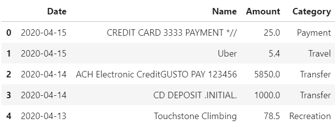 

After some further analysis we can see the how much was spent in each category:

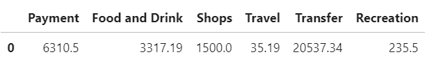 

Another way to visualize this data is with a pie chart which allows us to see spending percenteges for each category.

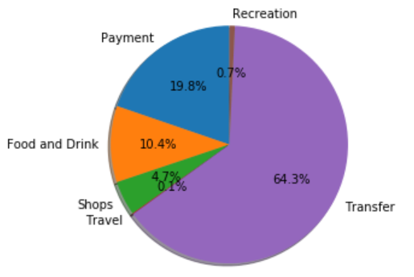

Here we can see the number of transactions made in each category.
The category we spent the most in is not neccesarly the categry where we made more transactions in. I would say this will show us what we use more often. Food and Travel are the categories we more often have transactions in.

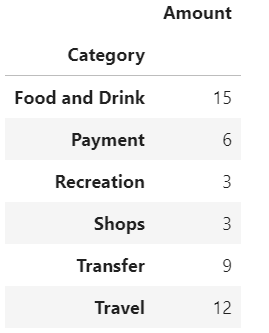

Another way to visualize this is with a bar plot:

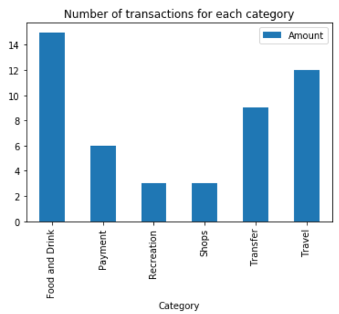

The last part of the analysis is to see how much we spent in total every month.

* Toatl spending January: $4084.83

* Toatl spending Feburary: $10145.24

* Toatl spending March: $11145.24

* Toatl spending April: $6560.41

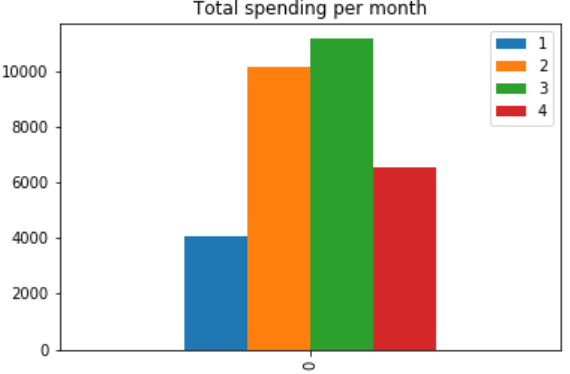

Since we asked for the last 90 days its not full 3 months, it starts fron the end of January then we have full Feburary and March and the begining of April.

## Retirement Planning

For this part we used  Alpaca api to grab historical data for a 60/40 portfolio using SPY to represent the stock portion and AGG to represent the bonds.

This first data frame hold the closing prices for AGG and SPY.

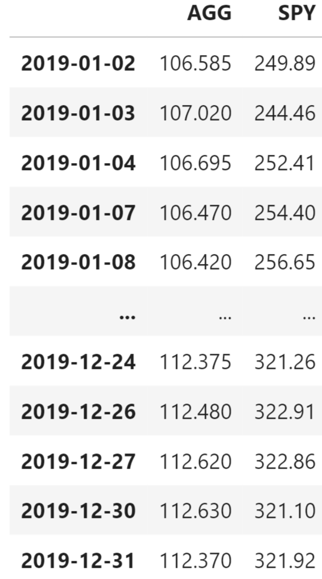

The next step is to calculate the daily returns and this is what you can see here:

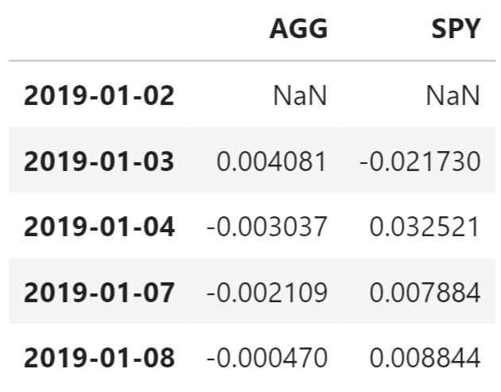

Now we want to run monte carlo simulation. It will run 500 times each time for 30 years (252*30).
Basically in each loop we calculate the new price based on the last price, we use the average daily return and avarage standart devision to help us get the best estimate.

In this data frame we can see the monte carlo simulation we ran after we calculated the cumulative returns.
The size of this table is 7,560 rows x 500 columns
co responding to 500 simulations and 30 years in each. Here we only showed a few rows since the size is too big.

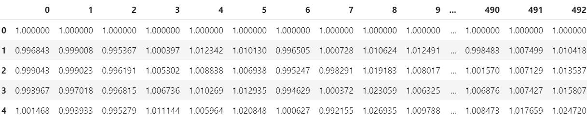

Here we ploted the 500 simulations we ran:

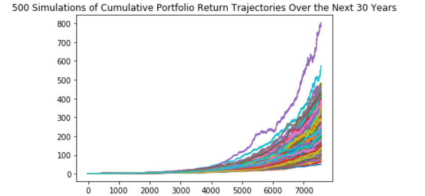

The next step was to claculate the 90% interval
 for the last possible numbers we got in the simulation, we call it ending cumulative returns.

 You can see here that 90% of the numbers we got are between the red lines.

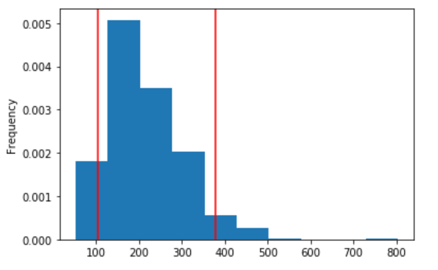

In this section,we calculated and ploted the cumulative returns for the median and 90% confidence intervals. This plot shows the expected cumulative returns for any given day between the first day and the last day of investment.

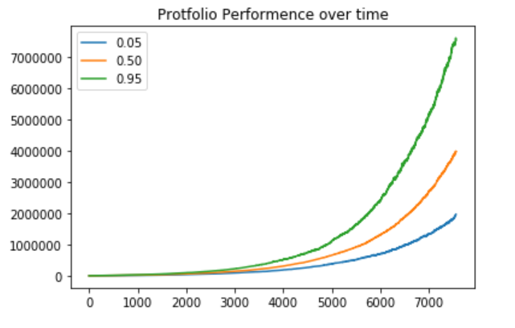
