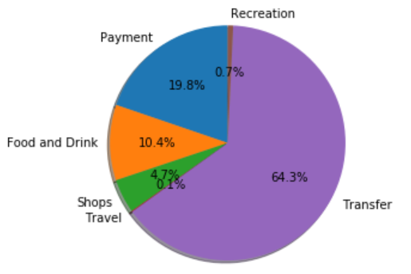

# Financial Report
## Budget Analysis
We extracted transaction data for the last 90 days. The information recived was for 48 transaction between 01/25/2020 and 04/15/2020 all transactions  in these 5 categories: Payment, Food and Drink, Shops, Travel, Transfer and Recreation. Total of transactions  was $31935.72.

This is part of the data frame we created to store the information:

 

After some further analysis we can see the how much was spent in each category:

 

Another way to visualize this data is with a pie chart which allows us to see spending percenteges for each category.

Here we can see the number of transactions made in each category.
The category we spent the most in is not neccesarly the categry where we made more transactions in. I would say this will show us what we use more often. Food and Travel are the categories we more often have transactions in.

Another way to visualize this is with a bar plot:

The last part of the analysis is to see how much we spent in total every month.

* Toatl spending January: $4084.83

* Toatl spending Feburary: $10145.24

* Toatl spending March: $11145.24

* Toatl spending April: $6560.41

Since we asked for the last 90 days its not full 3 months, it starts fron the end of January then we have full Feburary and March and the begining of April.